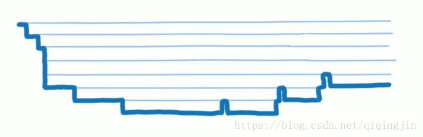

title: react fiber 学习记录 【一】
tags:
  - react
  - react学习记录
  - 学习记录
categories: []
date: 2019-05-27 22:31:00
---
### 一、为什么要了解React Fiber
起因是我们项目的UI库进行了x位版本的升级，也就是`0.x => 1.x`的一次升级，这个UI库的1.x版本依赖使用`react 16`，而0.x版本和我们的项目是依赖使用的`react 15`，在查阅了官方和别人的升级过程后，发现
- `componentWillMount`
- `componentWillUpdate`
- `componentWillRecieveProps`

三个生命周期被官方标记为不安全，在`react 16`中可以增加`UNSAFE_`前缀来使用
- `UNSAFE_componentWillMount`
- `UNSAFE_componentWillUpdate`
- `UNSAFE_componentWillRecieveProps`

并增加了两个新的生命周期
- `static getDerivedStateFromProps`
- `getSnapshotBeforeUpdate`

在`react 17`进行正式取代。

本着求知的精神继续查阅发现react官方将推行`异步渲染`这一功能。
而被标记为不安全的生命周期在异步渲染的过程中会被`重复触发`，故被标记为不安全并被取代。

### 二、什么是异步渲染，为什么要使用它
在react 16以前，对我们的react组件的更新和渲染是以`深度优先`、`堆栈`和`同步`的方式进行的，它会一直执行到栈空为止。

就是当一次更新或者一次加载开始以后，diff virtual dom并且渲染的过程是一口气完成的。如果组件层级比较深，相应的堆栈也会很深，长时间占用浏览器主线程，一些类似`用户输入`、`鼠标滚动`等操作得不到响应。借Lin的两张图，视频 [A Cartoon Intro to Fiber - React Conf 2017](https://www.youtube.com/watch?v=ZCuYPiUIONs)

而异步渲染的方式可以解决上面的问题，就是把一整个渲染任务拆分成一个一个小任务，并根据系统的空闲时间进行渲染